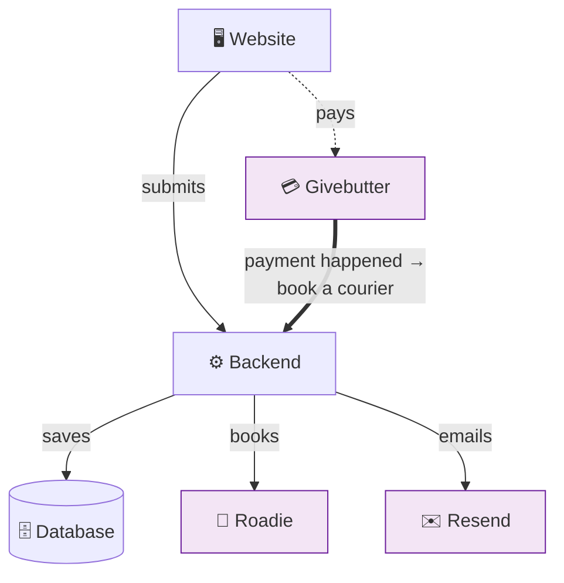

# How the Donation App Is Built — Quick Guide

*The pieces, and how they connect. (Full detail? See
[the detailed version](architecture-donation-app.md).)*

---

## The pieces

**Ours:**
- 🖥️ **Website** — the wizard the donor fills in
- ⚙️ **Backend** — the logic (saves donations, books couriers, sends email)
- 🗄️ **Database** — stores every donation + its status

**Rented (the parts that cost money and can break on their own):**
- 💳 **Givebutter** — takes the contribution
- 🚚 **Roadie** — the courier
- ✉️ **Resend** — sends the emails

---

## How they connect

**The thick arrow is the important one.** When a donor pays, Givebutter tells the
backend, and *that* is what books the courier. If a pickup ever stalls, this is
usually where to look.

---

## What happens, in one breath

Donor fills in the wizard → backend **saves** it → **Ship / Drop-off** are done
(donor gets an email) → **Pickup** waits for payment → donor pays → Givebutter tells
the backend → backend **books Roadie** + emails the donor → Roadie runs the pickup.

---

## The backend is just 4 small programs

| Program | Runs when |
| --- | --- |
| Save a new donation | Donor submits the wizard |
| Book the courier after payment | Givebutter reports a payment |
| "We're on it" email | Every hour (for failed bookings) |
| "Finish your donation" email | Every day (for unpaid pickups) |

---

## Three apps, one database

The donation app shares its Google Firebase database with two sister apps — the
**Inventory system** and the **Data dashboard** — so a donation here can reach the
warehouse with no manual hand-off. *(Whole picture → System Overview doc.)*
