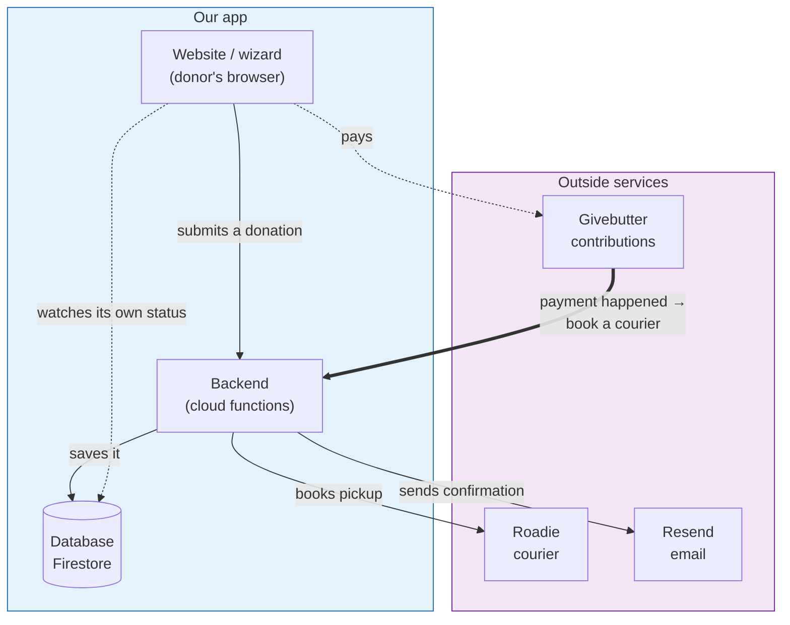

# Architecture — Donation App

> **Who this is for:** Anyone who needs to understand how the donation app is put
> together — what the pieces are, how they talk to each other, and where things
> live — without reading the code. Non-technical readers can stop at
> _[Built to grow](#built-to-grow)_; a technical successor should keep going into
> the appendix. Companion docs: **Donation Lifecycle & State Machine** (what a
> donation _does_) and **Accounts & Services** (how to sign in to each piece).

---

## What this app is

A public website where a donor gives beauty products three ways — a courier
**pickup**, **shipping** the items themselves, or an in-person **drop-off** — and the
system arranges the logistics. There's no login. A donor fills out a short wizard, and
behind the scenes the app records the request, (for pickups) confirms their
contribution and books a courier, and emails them a confirmation.

---

## The moving parts

Think of it as **your two pieces** plus **three outside services** you rent.

| Piece                             | Who runs it             | What it does                                             |
| --------------------------------- | ----------------------- | -------------------------------------------------------- |
| **The website** (the wizard)      | Us                      | What the donor sees and fills in, in their browser       |
| **The backend** (cloud functions) | Us (on Google Firebase) | The logic: saves donations, books couriers, sends emails |
| **The database** (Firestore)      | Google Firebase         | Stores every donation and its current status             |
| **Givebutter**                    | Outside service         | Takes the donor's pay-what-you-wish contribution         |
| **Roadie**                        | Outside service         | The courier network that picks up and delivers           |
| **Resend**                        | Outside service         | Sends the confirmation and reminder emails               |

The three outside services are the only things that cost money to run and the only
things that can break independently of our code. Most troubleshooting comes down to
"which of these three is unhappy?"

---

## How it fits together



**The one arrow that matters most** is the thick one: Givebutter → backend. When a
donor pays, Givebutter _tells our backend_, and that message is what triggers the
courier booking. Everything downstream of a pickup hangs on that one message arriving.

---

## The flow in one paragraph

The donor completes the wizard and the website calls the backend, which **saves the
donation** to the database. Shipping and drop-off are done at that point (the donor was
shown what to do, and gets an email immediately). A **pickup** is saved as "waiting for
payment" and stops there — no courier yet. The donor pays in Givebutter; Givebutter
pings the backend; the backend **books Roadie** and emails the confirmation. From then
on Roadie runs the pickup and sends the donor its own driver updates. _(The full
step-by-step, including what happens when something stalls, is in the **Donation
Lifecycle & State Machine** doc — this doc is about the parts, that one is about the
journey.)_

---

## Where the data lives

Every donation — regardless of method — is a single record in one database table
(`donation_requests`). One record holds:

- **Who** the donor is (name, email, phone)
- **What method** they chose (pickup / shipping / dropoff) and its details (addresses, preferred time, notes)
- **The contribution** info (for pickups)
- **The status** — the one word for where it is (see the lifecycle doc)
- **Timestamps and notes** the system stamps as it works (when each email went out, the courier's tracking ID, etc.)

There are no separate tables per donation type — the method is just a field on the
record. That's deliberate: one place to look for any donation.

---

## The backend, function by function

The backend is **four** small programs ("cloud functions"). Two run when triggered;
two run on a timer.

| Function                       | Runs when…                   | What it does                                                                                                                                           |
| ------------------------------ | ---------------------------- | ------------------------------------------------------------------------------------------------------------------------------------------------------ |
| `createDonationRequest`        | The donor submits the wizard | Validates the form, saves the donation, and (for ship/drop-off) sends the confirmation email right away                                                |
| `handleGivebutterWebhook`      | Givebutter reports a payment | Confirms the payment matches a real donation, books the Roadie courier, and emails the pickup confirmation. If the booking fails, marks it for a human |
| `sendStalledDonationSlaEmails` | Every hour                   | Reassures donors whose payment went through but whose courier booking failed                                                                           |
| `sendStalledRecoveryEmails`    | Every day, 9 AM ET           | Nudges donors who started a pickup but never finished paying                                                                                           |

The last two are the automatic safety nets described in the lifecycle doc.

---

## How we keep it safe

- **The public can only create, never read broadly.** The database rules let anyone
  submit a donation, but nobody can list or browse other people's donations. A donor
  can only look up their _own_ donation, and only because they hold its unguessable ID.
- **Payment messages are authenticated.** The Givebutter → backend message is signed
  with a shared secret. If the signature is missing or wrong, the backend rejects it —
  so nobody can fake a "payment happened" message to get a free courier. If the secret
  isn't configured, the backend refuses all such messages rather than trusting them.
- **Couriers can't be double-booked.** Each booking carries the donation's ID as an
  "idempotency key," so a repeated message can't book two couriers for one donation.
- **A courier is never booked without a confirmed contribution** at or above the
  minimum ($15 by default).

---

## Configuration & environments

- **Website settings** (which Firebase project, the warehouse details shown to donors,
  the Givebutter campaign link) live in the frontend's environment files.
- **Backend settings** live in the functions' environment file, and **secrets** (the
  Roadie key, the Givebutter keys, the webhook signing secret) live in Google's Secret
  Manager — never in plain files, never in the code repository.
- Full inventory of every key, where it lives, and how to rotate it is in the
  **Accounts & Services** doc.

---

## Built to grow

Beauty Forward runs **three** delivered apps that share one Google Firebase project:

1. **This donation app** — the public-facing logistics site.
2. **The Inventory system (IMS)** — the warehouse's stock management, which picks up
   donations from the shared database automatically.
3. **The Data dashboard** — reporting and analytics on top of the same data.

Because they share a project, a donation recorded here can flow to inventory without
any manual hand-off. This document covers only the donation app; the whole-picture map
of all three lives in the **System Overview** doc, and each app gets its own
architecture section as it's documented.

---

## Appendix — for the technical successor

**Stack.** Angular 21 (standalone components, mobile-first SCSS) frontend; Firebase
Cloud Functions v2 (TypeScript, single `donor` codebase, region `us-central1`);
Firestore for data. Hosted on Firebase App Hosting.

**Frontend shape.** Every route loads one component,
`features/wizard/donation-wizard-page.component.ts`, switched by the route's
`data.mode` (`home`, `pickup`, `pickup-review`, `pickup-confirmation`, and the shipping
/ dropoff equivalents). The standalone components under `features/method-selection`,
`features/pickup`, `features/dropoff` are **older, unrouted** versions — don't edit them
expecting to change the live flow. Core services live in `src/app/core/services/`
(`donation-api.service.ts` calls the backend; `donation-wizard-state.service.ts` holds
the wizard's in-progress state; `contribution.service.ts` handles the Givebutter link).

**The `requestId` is the spine.** The browser generates an unguessable UUID up front
and uses it as: the Firestore document ID, the Roadie idempotency key, and — critically
— the `utm_campaign` value passed into the Givebutter checkout link. That last one is
how the webhook later matches a payment back to a donation
(`data.utm_parameters.utm_campaign === requestId`). No tag, no match — this is the root
of the orphaned-payment gap.

**Backend files** (`functions/src/`): `create-donation-request.ts`,
`givebutter-webhook.ts` (also exports `sendEmailOnce`, `buildNextSteps`),
`sendSlaEmails.ts` (both scheduled sweeps), `validators.ts` (Zod schemas +
`getPickupDonationMinUsd`), `warehouse.ts` (hardcoded warehouse address/contact),
`services/` (`roadie.service.ts`, `givebutter.service.ts`, `resend.service.ts`),
`email/` (per-email HTML builders). Entry points are re-exported from `index.ts`;
`init.ts` must import first (runs `initializeApp()` + loads env).

**Firestore rules** (`firestore.rules`): `create: true`, `get: true` (single-doc by
id), `list/update/delete: false`. Server-side Zod validation is the real gate; the
open `create` is a fallback path the wizard can use directly.

**Deploy.** Functions: `cd functions && npm run deploy` (`firebase deploy --only
functions:donor`). Secrets via `firebase functions:secrets:set <NAME>`. See the
repository `README.md` for local emulator setup and the full env-var list.

> **Docs vs README:** the repository `README.md` still describes an older design
> (synchronous dispatch inside `createDonationRequest`, an eight-status model, and
> `createContributionSession` / `verifyContributionAndDispatch` /
> `lookupDonationByReference` functions). Those are **gone** — the live design is the
> four functions above with the webhook as the only path to dispatch. Trust this doc
> and the code; the README needs a cleanup pass.

```

```
