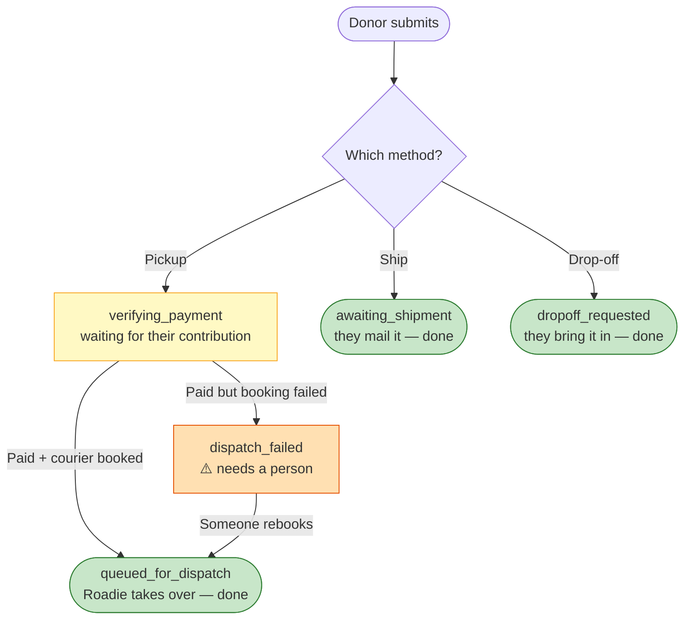

# Donation Lifecycle — Quick Guide

_Every donation has a **status**: one word for where it is. There are five.
This shows what they mean and when to step in. (Need the full detail? See
[the detailed version](donation-lifecycle-state-machine.md).)_

---

## The journey

🟢 green = finished, all good 🟡 yellow = wait a bit 🟠 orange = **you're needed**

---

## The five statuses

| Status                   | Means                           | Do you act?       |
| ------------------------ | ------------------------------- | ----------------- |
| 🟡 `verifying_payment`   | Waiting for the donor to pay    | No — give it time |
| 🟢 `queued_for_dispatch` | Paid + courier booked           | No — done         |
| 🟠 `dispatch_failed`     | **Paid, but no courier booked** | **Yes — rebook**  |
| 🟢 `awaiting_shipment`   | Donor will mail it              | No — done         |
| 🟢 `dropoff_requested`   | Donor will bring it in          | No — done         |

**Only one status ever needs you: `dispatch_failed`.**

---

## Stuck? Do this

**🟠 `dispatch_failed`** → The donor paid; the courier didn't book.
→ **Rebook the courier in Roadie.** (The donor was already emailed a "we're on it" note automatically.)

**🟡 `verifying_payment` for hours** → Usually the donor never finished paying. That's normal — the app emails them a reminder on its own. Only worry if they _say_ they paid → check Givebutter for their payment, then ask your tech help.

**🟢 Everything else** → No action. Ship and drop-off just wait on the donor; a booked courier is Roadie's job now.

---

## Where to look

| Question               | Go to          |
| ---------------------- | -------------- |
| What status is it?     | **Firebase**   |
| Did they actually pay? | **Givebutter** |
| Where's the courier?   | **Roadie**     |

_Sign-in details → see the Accounts & Services doc._
