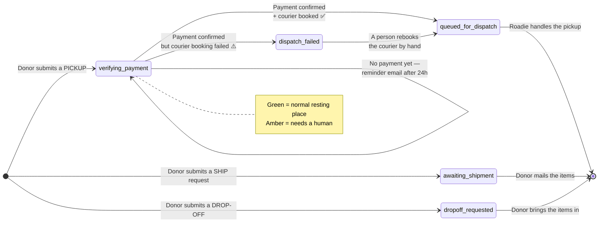

# Donation Lifecycle & State Machine

> **Who this is for:** Anyone on the Beauty Forward team who needs to understand
> what a donation is doing right now, why one might be stuck, and what to check —
> without needing to read code. No engineering background assumed. A few technical
> terms are unavoidable; each is explained the first time it appears.

---

## The one idea to hold onto

Every donation is a single record in our database with a **status** — a one-word
label saying where it is in its journey. There are only **five** statuses. Most of
the time a donation reaches its resting status within seconds and never moves again.
When something goes wrong, the status is the first place you look — it tells you
*exactly* what happened and what to do next.

The system moves donations between statuses automatically. Nobody sets a status by
hand in the normal course of business. A human only steps in when a donation gets
**stuck**, and this document tells you how to recognize that and what to do.

---

## The three kinds of donation

A donor picks one of three ways to give, and each follows its own short path:

| Method | What the donor does | Involves payment? |
| --- | --- | --- |
| **Pickup** | A courier (Roadie) collects the items from the donor's address | **Yes** — a courier is only booked once a contribution is confirmed |
| **Ship** | The donor mails the items to the warehouse themselves | No |
| **Drop-off** | The donor brings the items to a location in person | No |

Only **pickup** has moving parts worth watching. Ship and drop-off are recorded and
done — there's nothing for the system to chase.

---

## The five statuses at a glance

| Status | Applies to | What it means | Is this normal? |
| --- | --- | --- | --- |
| `verifying_payment` | Pickup | Request received; we're waiting for the donor's contribution to be confirmed before booking a courier | ✅ Normal for a few minutes. ⚠️ A problem if it sits here for hours |
| `queued_for_dispatch` | Pickup | Contribution confirmed **and** courier successfully booked. Roadie takes it from here | ✅ This is the finish line for a pickup |
| `dispatch_failed` | Pickup | Contribution confirmed, but the courier booking failed. **The donor paid; no courier is coming yet** | ⚠️ Always needs a human to rebook |
| `awaiting_shipment` | Ship | Request recorded; donor was told the warehouse address and will mail the items | ✅ Finished on our end |
| `dropoff_requested` | Drop-off | Request recorded; donor was given a reference code to bring in | ✅ Finished on our end |

> **The one status that always needs you:** `dispatch_failed`. It means the money
> came through but the courier didn't get booked. The system will email the donor a
> reassurance note automatically, but **only a person can actually rebook the courier.**

---

## The journey, as a picture



---

## How a pickup actually moves (plain-English walkthrough)

**1. The donor submits the pickup request.**
We save the donation and set it to `verifying_payment`. At this moment the donor is
sent off to Givebutter (our donations platform) to make their pay-what-you-wish
contribution. **No courier is booked yet** — we don't book a courier until we know a
qualifying contribution actually went through.

**2. Givebutter tells us the payment succeeded.**
When the donor completes their contribution, Givebutter sends us an automatic
message (a "webhook" — one system pinging another to say "this just happened").
That message is the *only* trigger that moves a pickup forward. Two things can happen
from here:

- **The courier books successfully → `queued_for_dispatch`.** We book Roadie, save
  the courier's tracking ID, and email the donor their confirmation. Done. Roadie now
  sends the donor their own "your driver is on the way" texts and updates — those come
  from Roadie, not from us.
- **The courier booking fails → `dispatch_failed`.** The payment is confirmed and the
  money is real, but Roadie couldn't be booked (an outage, a rejected address, etc.).
  We record the confirmed amount and stop. **This is the one case that needs you.**

**3. If the donor never pays, the donation just sits in `verifying_payment`.**
Nothing forces a donor to finish paying. If they close the tab, the donation stays in
`verifying_payment` indefinitely. That's not an error — it's an abandoned checkout.
The system has an automatic nudge for this (below).

---

## The automatic safety nets

Two background jobs run on a schedule and quietly clean up stuck pickups. You don't
start them — they run on their own. Knowing they exist explains emails donors may
mention receiving.

### Safety net 1 — "We're on it" (for `dispatch_failed`)

- **Runs:** every hour.
- **Looks for:** pickups stuck in `dispatch_failed` that were created in the **last 48
  hours**.
- **Does:** emails the donor once to reassure them ("your contribution went through,
  we're finalizing your courier") and logs the donation so the team knows to rebook.
- **Why the 48-hour limit:** so a much older, already-handled stall doesn't suddenly
  email a donor out of the blue. Anything older is written to the logs for manual
  review instead of emailed.
- **The email is not the fix.** It buys goodwill and time. **A person still has to
  rebook the courier** — see the troubleshooting section.

### Safety net 2 — "Complete your donation" (for abandoned `verifying_payment`)

- **Runs:** once a day, 9:00 AM Eastern.
- **Looks for:** pickups stuck in `verifying_payment` that are **between 24 hours and 7
  days old** (old enough that they clearly abandoned checkout, recent enough to be
  worth recovering).
- **Does:** emails the donor once, gently nudging them to finish their contribution.
- **Why the age window:** under 24 hours, they might simply still be mid-checkout — we
  don't want to pester them. Over 7 days, it's too late to be worth an automated nudge,
  so it's logged for manual review instead.

Each donor gets each of these emails **at most once** — the system marks a donation the
moment it sends one, so a donor is never spammed by repeated runs. And if a donation
resolves on its own (the donor pays, or the team rebooks) before the next run, the job
simply skips it.

---

## Troubleshooting: "a donation looks stuck"

Find the status, then follow the row.

### `verifying_payment` for more than an hour or two

**Most likely:** the donor started a pickup but never finished paying in Givebutter.
This is normal and expected — not every visitor completes.

- **Check:** did a matching contribution actually come through in **Givebutter**? Search
  by the donor's email around the time they submitted.
- **If no payment exists:** nothing is broken. The donor abandoned checkout. The daily
  recovery email (Safety net 2) will nudge them once it's 24 hours old. No action needed.
- **If a payment *does* exist** but the donation is still `verifying_payment` after
  several minutes: the confirmation message from Givebutter may not have reached us (see
  *The one known gap* below). Escalate to your technical contact — this one needs a look
  at the logs.

### `dispatch_failed`

**Meaning:** the donor paid, we confirmed it, but the courier booking failed. **The
donor is expecting a pickup and none is booked.**

- **The donor has already been reassured** automatically (Safety net 1), so you have a
  little breathing room — but not much.
- **The fix is manual:** rebook the courier. Depending on how your team operates, that's
  either rebooking directly in the **Roadie** dashboard, or having your technical contact
  re-run the booking. Once a courier is booked, the donation should move to
  `queued_for_dispatch`.
- **Worth noting for a pattern:** a single `dispatch_failed` is usually a transient
  glitch. Several in a short window suggests a Roadie-side problem or a bad
  warehouse/address configuration — escalate.

### `queued_for_dispatch` but the donor says no driver came

This status means Roadie *accepted* the booking. After this point the pickup lives in
**Roadie's** system, and the driver updates come from Roadie directly.

- **Check the courier's status in the Roadie dashboard** using the tracking ID saved on
  the donation.
- This is a Roadie operational question (driver running late, cancelled, etc.), not a
  problem with our app.

### `awaiting_shipment` / `dropoff_requested` that "never arrived"

These statuses only mean *the donor told us their intention*. They don't track whether
the physical items showed up — we have no signal for that. A donor who requested a
drop-off or said they'd ship but never did will simply stay in this status forever, and
that's expected. There's nothing to fix in the app.

---

## The one known gap: orphaned payments

There is a single scenario the system genuinely can't catch, and it's worth
understanding so it doesn't look like a bug.

When a donor pays, Givebutter's confirmation message carries a hidden tag that tells us
*which* donation the payment belongs to. If a donor somehow reaches Givebutter and pays
**without that tag attached** — for example by finding the campaign through a different
link — the payment succeeds on Givebutter's side, but our system has no way to match it
back to a donation. The donation stays in `verifying_payment`, and the donor's real
payment leaves **no trace in our app.**

- **Symptom:** a donor insists they paid, but their donation is stuck in
  `verifying_payment` and no automated email resolved it.
- **How to confirm:** find the matching contribution in **Givebutter** by email/amount.
  If it's there but our donation never advanced, this is the orphaned-payment case.
- **What to do:** treat it as a manual rescue — confirm the payment in Givebutter, then
  have your technical contact book the courier for that donation by hand. This scenario
  is on the v2 improvement list to close properly.

---

## Where each status lives (quick reference)

| To check… | Look in… |
| --- | --- |
| A donation's current status and history | **Firebase** (the `donation_requests` database) |
| Whether a contribution actually went through | **Givebutter** |
| Where a booked courier is | **Roadie** |
| Whether a donor email was sent | **Resend** (email logs) — and the donation's own record notes when each email went out |

> Detailed sign-in instructions and account ownership for each of these live in the
> **Accounts & Services** document.

---

## For the technical successor

The precise mechanics behind the plain-English description above:

- **Statuses** are defined in `functions/src/models.ts` (`DonationStatus`).
- **Initial status** is set in `functions/src/create-donation-request.ts`. Pickups →
  `verifying_payment`; ship → `awaiting_shipment`; drop-off → `dropoff_requested`
  (the last two also send their confirmation email inline at creation).
- **The only transition into `queued_for_dispatch` / `dispatch_failed`** is
  `handleGivebutterWebhook` in `functions/src/givebutter-webhook.ts`. It matches the
  Givebutter transaction to a donation via `data.utm_parameters.utm_campaign`
  (= our `requestId`), checks the amount against `PICKUP_DONATION_MIN_USD`, books
  Roadie, and branches on success/failure. The webhook authenticates every request via
  a `Signature` header and **fails closed** if `GIVEBUTTER_WEBHOOK_SIGNATURE` is unset.
- **The two sweeps** are `sendStalledDonationSlaEmails` (hourly, `dispatch_failed`, 48h
  window) and `sendStalledRecoveryEmails` (daily 09:00 ET, `verifying_payment`, 24h–7d
  window) in `functions/src/sendSlaEmails.ts`. Each is idempotent via a per-email
  timestamp flag (`slaEmailSentAt`, `recoveryEmailSentAt`, `confirmationEmailSentAt`).
- **Orphaned payments** are the direct consequence of matching on `utm_campaign`: no
  tag, no match. The webhook only ever *updates* an existing donation; it never creates
  one.
```
