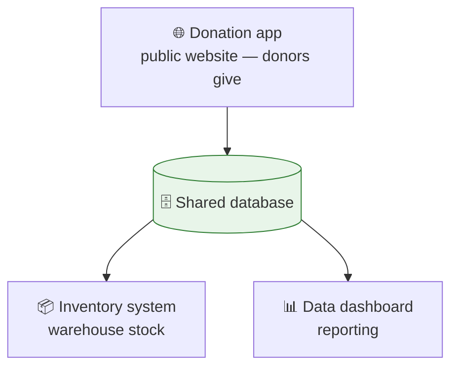

# Beauty Forward Software — Quick Map

_Three apps, one shared database. (More detail? See
[the detailed version](system-overview.md).)_

---

---

## The three apps

- 🌐 **Donation app** — the public site where donors arrange a pickup, shipment, or drop-off.
- 📦 **Inventory system (IMS)** — the warehouse's stock, which pulls in donations automatically.
- 📊 **Data dashboard** — reporting across all of it.

They all share **one Google Firebase database**, so donations flow between them with no
manual hand-off.

---

## Start here

- Something's stuck? → **Donation Lifecycle** doc
- Need to sign in somewhere? → **Accounts & Services** doc
- How's it built? → **Architecture** doc
