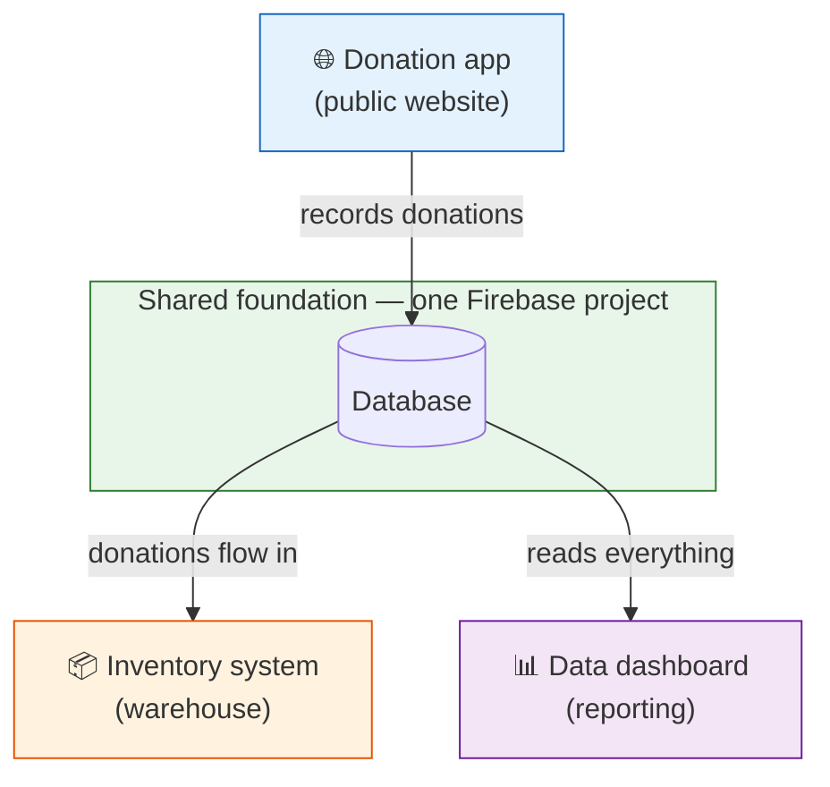

# Beauty Forward — System Overview

> **Who this is for:** Anyone picking up responsibility for Beauty Forward's software.
> Start here. This is the map: what the software is, the three apps that make it up,
> how they connect, and where to read more about each. No technical background needed.

---

## What the software does

Beauty Forward moves **donated beauty products** from donors into the warehouse and
onward to the people served — and keeps track of every step. The software is what makes
that run: it takes donations from the public, manages the warehouse's stock, and reports
on the whole operation.

It's **three apps that share one foundation** (a single Google Firebase project and its
database). Because they share that foundation, information flows between them without
anyone re-keying it: a donation captured by the public site can show up in the warehouse
system automatically.

---

## The three apps

| App | What it's for | Who uses it |
| --- | --- | --- |
| **Donation app** | The public website where donors arrange a pickup, shipment, or drop-off | The public (donors) |
| **Inventory system (IMS)** | Manages the warehouse's stock — what's come in, what's on hand | The warehouse / ops team |
| **Data dashboard** | Reporting and analytics across everything | Leadership / staff |

---

## How they connect

The **database in the middle is the shared truth.** The donation app writes to it, the
inventory system picks donations up from it automatically, and the dashboard reads from
it to report. No app is an island.

---

## Where to read more — the full doc set

Documentation is built out one app at a time. Today the **donation app** is fully
documented; the other two get the same treatment as they're written up.

**Every doc comes in two versions:** a **detailed** one, and a **quick** one — a short,
diagram-first version for a fast read. Pick whichever fits the moment.

### Donation app

| Doc | What it's for | Detailed | Quick |
| --- | --- | --- | --- |
| **Architecture** | How the app is built — the pieces and how they connect | [read](architecture-donation-app.md) | [quick](architecture-donation-app-simple.md) |
| **Donation Lifecycle & State Machine** | What a donation does, and how to troubleshoot a stuck one | [read](donation-lifecycle-state-machine.md) | [quick](donation-lifecycle-simple.md) |
| **Internal User Guide** | Running donations day to day (for the team) | [read](user-guide-internal.md) | [quick](user-guide-internal-simple.md) |
| **External User Guide** | How to donate (for donors) | [read](user-guide-external.md) | [quick](user-guide-external-simple.md) |

### Everything

| Doc | What it's for | Detailed | Quick |
| --- | --- | --- | --- |
| **Accounts & Services** | Every account, who owns it, where to sign in | [read](accounts-and-services.md) | [quick](accounts-and-services-simple.md) |

### Coming later

- **Inventory system (IMS)** and **Data dashboard** — architecture sections to be added
  as those apps are documented.

> **Note:** the repository `README.md` is the developer's entry point (local setup,
> deploy, code structure) and points here. It has some known stale spots — trust these
> docs and the code where they differ.

---

## The short version

Three apps, one shared database, one mission: get donated products in, tracked, and
reported. If you're troubleshooting a specific donation, jump to the **Donation
Lifecycle** doc. If you need to sign in to something, the **Accounts & Services** doc is
your key ring.
