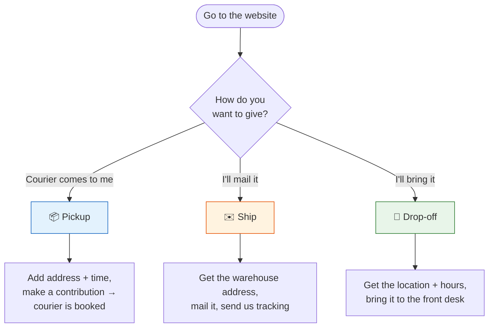

# How to Donate — Quick Guide

_Three ways to give. Pick one. (More detail? See
[the full guide](user-guide-external.md).)_

---

---

## 📦 Pickup — a courier collects it

1. Your details + pickup address + a time window
2. A pay-what-you-wish contribution (small minimum) covers the courier
3. Done → we email you, and the courier texts you when a driver's on the way

_No confirmation? The courier books only **after** payment. Didn't finish paying? Come back — we'll also remind you._

## ✉️ Ship — you mail it

1. Your details
2. We email you the **warehouse address**
3. Mail it, then **send us your tracking number**

## 📍 Drop-off — you bring it

1. Your details
2. We email you the **drop-off location + hours** (Mon–Fri, 9 AM–5 PM)
3. Bring it in, leave it at the front desk — _"it's for Beauty Forward"_

---

**No account or password needed, ever.** Questions? Reply to any Beauty Forward email.
