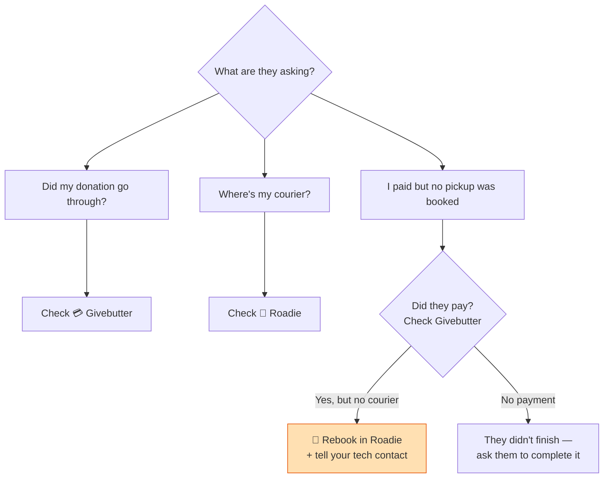

# Team Guide — Quick Version

*Running donations day to day. (More detail? See [the full guide](user-guide-internal.md).)*

---

## Your two tools

- 💳 **Givebutter** → did they pay?
- 🚚 **Roadie** → where's the courier? (and book/rebook one)

Everything else runs automatically. You **don't** touch the database — that's your
**technical contact**.

---

## When a donor asks…

---

## The one thing that's yours to fix

**Paid, but no courier booked** → **rebook it in Roadie.** Then let your technical
contact know so they can tidy the record.

*One now and then = normal. Several at once = escalate.*

---

## Physical donations

- 📦 **Shipped** → donor mails it + emails you a tracking number. Watch for it.
- 📍 **Drop-off** → donor brings it during opening hours, leaves it at the front desk.

---

## Escalate to your tech contact when…

- Payment shows in Givebutter but nothing happened for days
- A donor got **no email at all**
- **Several** failed bookings at once
- Anything needing a look **inside the database**

*Include: donor name + email, when, which method, what they're seeing.*
